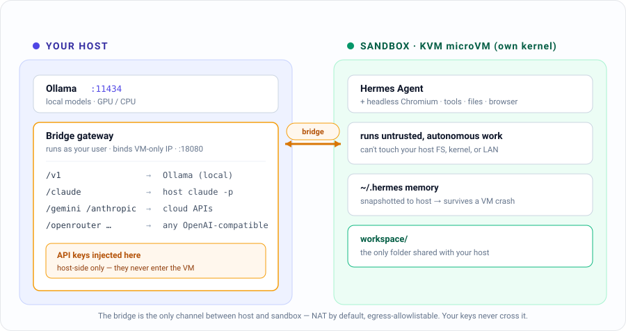
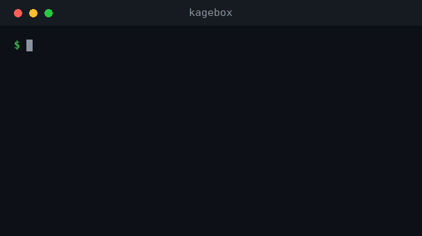
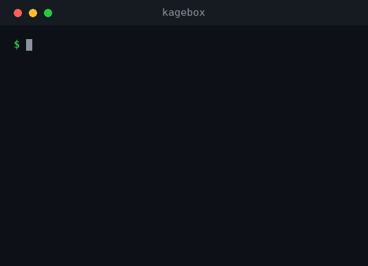

# Kagebox

> **Run autonomous AI agents safely** — isolated microVM, host-side credentials, controllable egress, auditable.

[](https://github.com/kunalkushwaha/Kagebox/actions/workflows/ci.yml)
&nbsp;[](LICENSE)

[Hermes Agent](https://github.com/NousResearch/hermes-agent) executes arbitrary shell,
edits files, and drives a browser — so **Kagebox** runs it inside a **KVM microVM**
(its own kernel) that can't touch your host, reaching LLMs through a **bridge that keeps
your API keys on the host**. Local models (Ollama) or cloud brains (Gemini, Claude, …)
are one command to switch, and the agent's memory survives a VM crash.

> ⚠️ It runs an autonomous, promptable agent. Read **[SECURITY.md](SECURITY.md)** —
> egress is **contained by default** (host-enforced allowlist); `./kagebox egress off`
> opens it — before trusting it with sensitive work.

## Architecture

<p align="center">
  
</p>

The **bridge** is the only channel from sandbox to host. Keys live in
`bridge/secrets.env` (host, git-ignored) and are injected into requests — they never
enter the VM. Providers are a runtime registry (`bridge/providers.json`).

## Requirements

- Linux host with **KVM** (`/dev/kvm`), **[multipass](https://multipass.run)**, and
  **[Ollama](https://ollama.com)** (for local models).
- Run `./kagebox doctor` to check everything at once.

## Quickstart

```bash
git clone https://github.com/kunalkushwaha/Kagebox.git && cd Kagebox
./kagebox doctor          # verify host prerequisites
./kagebox setup           # build the VM, bridge, and install Hermes (~10 min)
./kagebox shell           # enter the sandbox, then run:  hermes
```

<p align="center">
  <br><br>
  
</p>

Use a cloud brain for heavy research (key stays host-side):

```bash
cp bridge/secrets.env.example bridge/secrets.env
echo 'GEMINI_API_KEY=...' >> bridge/secrets.env      # free key: aistudio.google.com
./kagebox bridge start
./kagebox backend gemini
```

## Commands

| Command | What it does |
|---|---|
| `./kagebox doctor` | preflight-check the host |
| `./kagebox setup` / `destroy` | build / tear down the sandbox |
| `./kagebox up` / `down` / `status` | start / stop / inspect |
| `./kagebox shell` | shell into the VM (then run `hermes`) |
| `./kagebox backend <name>` | switch model: `ollama` · `claude` · `gemini` · … |
| `./kagebox providers` | list backends + cloud providers |
| `./kagebox telegram` | set up a Telegram bot to chat with Hermes |
| `./kagebox skills <...>` | install/manage Hermes skills (opens egress for the fetch, re-seals) |
| `./kagebox research "<q>"` | web-enabled run in a bounded window (opens, DNS-filters, re-seals) |
| `./kagebox warden setup` | let the sandbox **ask** for internet — you approve from your phone |
| `./kagebox autostart on` | keep the VM + bridge alive across logout and reboot |
| `./kagebox egress on` / `off` | **host-enforced** network egress allowlist (containment) |
| `./kagebox verify` | assert the sandbox boundary from inside the VM (fail-closed) |
| `./kagebox audit` | review the agent's API-call log |
| `./kagebox backup` / `restore` | snapshot / restore Hermes memory to the host |
| `./kagebox usage` | token & rough-cost usage per provider |
| `./kagebox snapshot` / `snapshots` / `rollback` | VM point-in-time snapshots |
| `./kagebox task "<prompt>"` | run a one-off task in a throwaway, egress-contained VM clone |

## Backends

- **`ollama`** — local models on your GPU/CPU. Free, private, offline. Best for quick
  tool-driven tasks. (Small models are fine as *tool drivers*; see `evals/model_eval.py`.)
- **`gemini` / `anthropic` / `openrouter`** — cloud brains via the bridge (key host-side).
  Best for real multi-step research. Add any OpenAI-compatible API to `bridge/providers.json`.
- **`claude`** — the host's `claude -p` (uses your existing Claude auth, no API key),
  invoked tools-disabled; also available to the agent as a "consult a stronger model" skill.

## Letting the agent reach the web

Egress is sealed by default, and the latch is on the **host** — the agent has root
inside the VM and still can't open it. But real work (search, skills, package installs)
needs the internet sometimes. Rather than punch a permanent hole, Kagebox opens
*bounded windows* and closes them again:

| Posture | How it opens | Good for |
|---|---|---|
| **Sealed** (default) | — | untrusted input; the agent reaches the model bridge and nothing else |
| **Allowlist** | add hosts to `vm/egress-allowlist.txt`, `./kagebox egress on` | a few known, stable endpoints |
| **Window** | `./kagebox skills …` / `./kagebox research "…"` | you're at a keyboard; opens for the run, re-seals after (even on Ctrl-C) |
| **Approved window** | `./kagebox warden setup`, then the agent asks | you're on your phone; the sandbox requests, **you tap approve** |

The **warden** is the interesting one. The messaging bot runs *inside* the VM, so it can
never open its own door — which also meant it could never search. The warden splits
asking from granting:

```
guest ──ask──> bridge ──unix socket──> warden (root, host) ──> Telegram ──> you tap
                                              │
                                    egress open N seconds → sealed again
```

The guest can ask; only you can grant. The approval bot **must be a second bot**, its
token root-only on the host — the in-VM bot's token already lives in the sandbox, so it
can't also be the credential guarding the door. Windows are capped (60s default, 300s
max, 8/hour) and always close: monotonic deadline in a `finally`, signal handlers, an
on-disk marker re-checked at startup, and systemd `ExecStopPost`.

> **Honest limit:** while a window is open the *whole VM* has internet, not just the
> search — a bounded window, not a narrow channel. And the reason shown to you is
> written by the guest, so approve on whether you *expected* the request, not on how
> good the reason reads. See [SECURITY.md](SECURITY.md).

## Staying up

`./kagebox autostart on` enables systemd **linger** and installs a unit that brings the
VM and bridge back after logout and reboot. Linger is the load-bearing part: without it
the bridge is a `--user` service that gets killed at logout and doesn't return until you
log in again — regardless of being "enabled". `./kagebox autostart status` reports the
whole picture (linger, unit, bridge, warden, multipassd) in one place.

## Memory & files

- **`workspace/`** — two-way shared folder; the agent saves deliverables here and they
  appear on your host. It's told to default outputs here.
- **`hermes-state/`** — the agent's memory (SQLite + sessions) is snapshotted here every
  10 min and on `down`, and restored on rebuild. Blow away the VM; your memory survives.

## Security

This is a containment tool for untrusted agent behavior. **[SECURITY.md](SECURITY.md)**
documents the full threat model — what's isolated (host FS, kernel, credentials, and
network egress, which is **host-enforced and contained by default**) and what isn't
(DNS + CDN-fronted allowlist entries are residual channels; an open window exposes the
whole VM, not just the agent; `workspace/` is a two-way door). Confirm the boundary from
inside the VM with `./kagebox verify` — every control here fails *open*, so one that
silently didn't load looks exactly like one that's working.

## Contributing

See **[CONTRIBUTING.md](CONTRIBUTING.md)**. No build step — it's shell + stdlib Python.

## License

[MIT](LICENSE)
